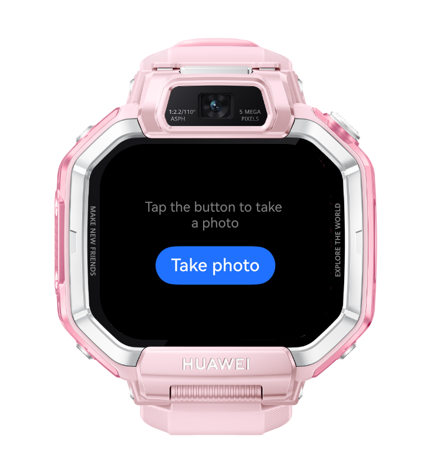
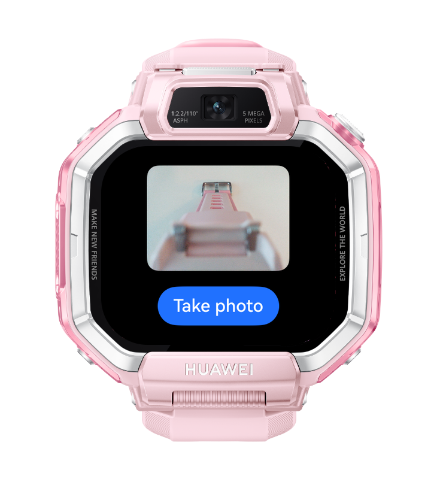

> **Note:** To access all shared projects, get information about environment setup, and view other guides, please visit [Explore-In-HMOS-Wearable Index](https://github.com/Explore-In-HMOS-Wearable/hmos-index).

# How to Implement Camera Kit on Kids Watch
This sample demonstrates how to integrate **Camera Kit** on a Kids Watch using the HarmonyOS `cameraPicker` system picker. 
Note: As a system picker, cameraPicker **requires no camera permission** 

# Preview
<div>
  
  
</div>

# Use Cases
- Access the camera from the Kids Watch application
- Use the camera feature without having to add additional permissions

# Tech Stack
- **Language:** ArkTS
- **Framework**: HarmonyOS SDK 6.1.1(24)
- **Tools** DevEco Studio 6.1.1 Release
- **Libraries**:
  - **Camera Kit:** `cameraPicker.pick()` + `camera.CameraPosition`
  - **Ability Kit:** `common.Context` used for cameraPicker.pick as it requires context
  - **Basic Services Kit:** `BusinessError` used for typed error handling

# Directory Structure
```
entry/src/main/
├── ets/
│   └── pages/
│       └── Index.ets  # Main Page with the cameraPicker demo
└── module.json5
```

# Constraints and Restrictions
## Supported Devices
- Huawei Watch Kids X1

# LICENSE
**How to Implement Camera Kit on Kids Watch** is distributed under the terms of the **MIT License**.
See the [LICENSE](/LICENSE) for more information.
